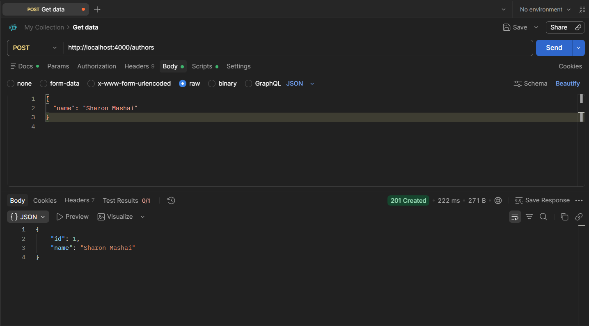
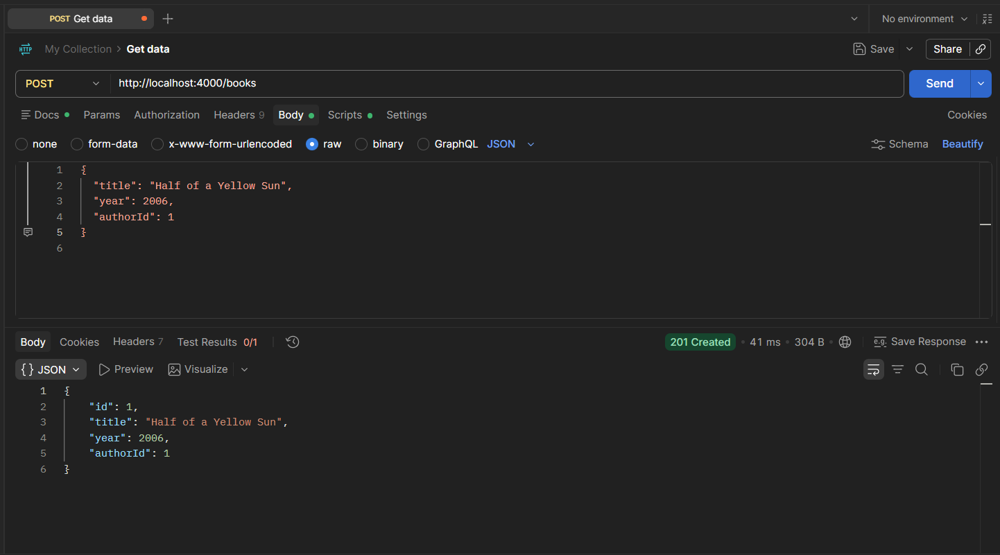
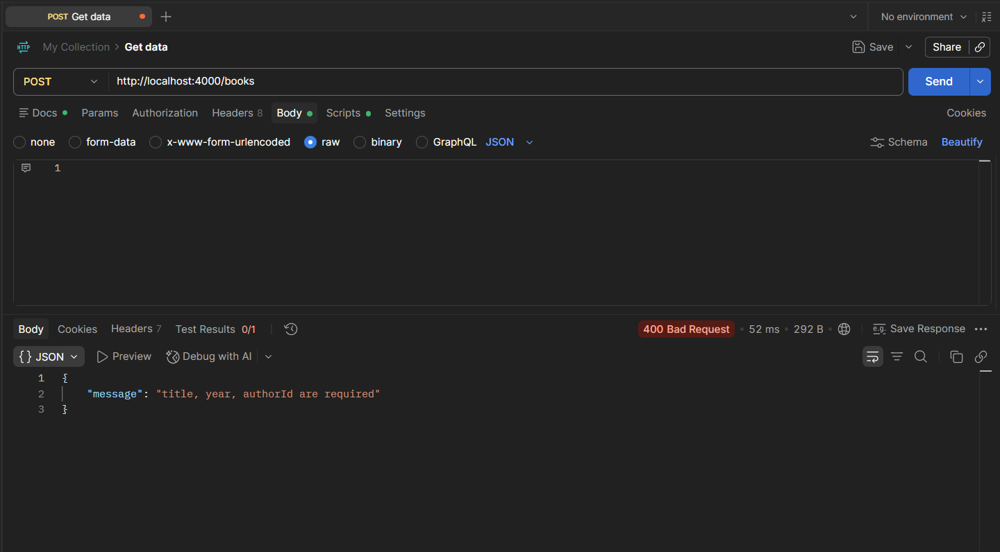
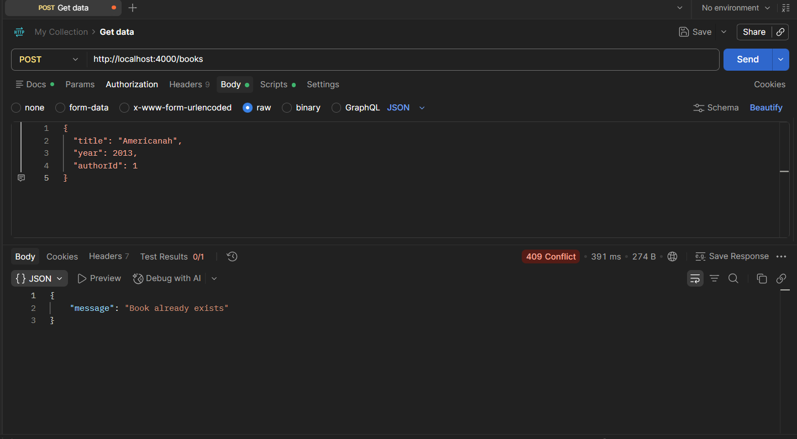
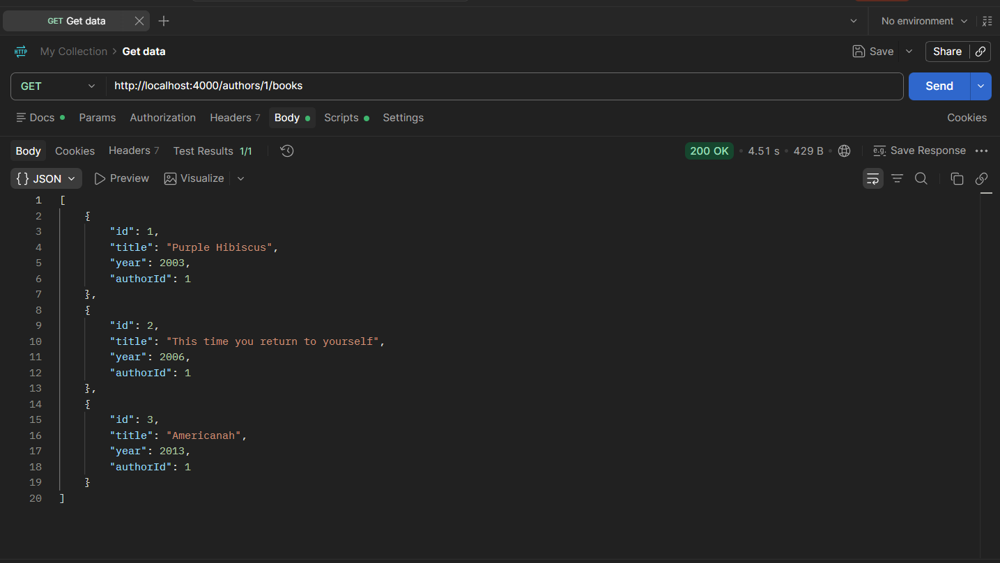
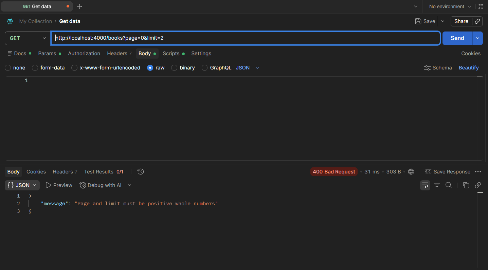

# Library API

A RESTful API built with **TypeScript**, **Node.js**, and **Express** for managing library authors and books.

The API allows librarians to create, retrieve, update, and delete authors and books. Each book belongs to an author through an `authorId`.

The project also includes input validation, centralized error handling, logging middleware, searching, filtering, sorting, pagination, and author-book relationships.

---

## Project Overview

The Library API manages two main resources:

* Authors
* Books

Each book must reference an existing author.

The API allows users to:

* Add new authors
* View all authors
* View a specific author
* Update authors
* Delete authors
* Add new books
* View all books
* View a specific book
* Update books
* Delete books
* View books belonging to a specific author
* Search books by title
* Filter books by year
* Search books by author
* Sort books by title or year
* Paginate book results

---

## Technologies Used

* Node.js
* Express
* TypeScript
* TSX
* Postman

---

## Features

### Author Management

The API supports full CRUD operations for authors:

* Create an author
* Get all authors
* Get an author by ID
* Update an author
* Delete an author
* Get all books belonging to an author

### Book Management

The API supports full CRUD operations for books:

* Create a book
* Get all books
* Get a book by ID
* Update a book
* Delete a book

### Validation

Book requests are validated before reaching the controller.

The API checks that:

* `title` is provided
* `year` is provided
* `authorId` is provided
* `title` is a valid string
* `year` is a number
* `authorId` is a number
* The supplied author exists

### Error Handling

The API provides appropriate HTTP status codes and JSON error messages.

Examples include:

* `400 Bad Request` – Invalid request data
* `404 Not Found` – Resource does not exist
* `409 Conflict` – Duplicate book
* `500 Internal Server Error` – Unexpected server error

### Logger Middleware

The API contains logger middleware that logs the HTTP method and URL of incoming requests.

Example:

```text
GET /books
POST /authors
PUT /books/1
DELETE /authors/2
```

### Searching and Filtering

Books can be searched or filtered by:

* Title
* Year
* Author name

### Sorting

Books can be sorted by:

* Title A-Z
* Year from oldest to newest
* Year from newest to oldest

### Pagination

Book results can be divided into pages using `page` and `limit` query parameters.

---
 
# Postman Screenshots

### Create Author

```text
POST /authors
201 Created
```



### Create Book

```text
POST /books
201 Created
```



### Validation Error

```text
POST /books
400 Bad Request
```



### Duplicate Book

```text
POST /books
409 Conflict
```



### Books by Author

```text
GET /authors/1/books
200 OK
```




### Pagination

```text
GET /books?page=1&limit=2
```



---

# Getting Started

## 1. Clone the Repository

Clone the project from GitHub:

```bash
git clone <your-repository-url>
```

Replace `<your-repository-url>` with the URL of your GitHub repository.

---

## 2. Open the Project

Navigate into the project:

```bash
cd library-API
```

You can then open it in Visual Studio Code:

```bash
code .
```

---

## 3. Install Dependencies

Run:

```bash
npm install
```

This installs all dependencies listed in `package.json`.

---

## 4. Run the Development Server

Start the API with:

```bash
npm run dev
```

The server runs on:

```text
http://localhost:4000
```

You should see:

```text
Server is running on http://localhost:4000
```

---

# Author Endpoints

## Create an Author

```http
POST /authors
```

Example request:

```json
{
  "name": "Chimamanda Ngozi Adichie"
}
```

Successful response status:

```text
201 Created
```

Example response:

```json
{
  "id": 1,
  "name": "Chimamanda Ngozi Adichie"
}
```

---

## Get All Authors

```http
GET /authors
```

Successful response:

```text
200 OK
```

Example:

```json
[
  {
    "id": 1,
    "name": "Chimamanda Ngozi Adichie"
  }
]
```

---

## Get Author by ID

```http
GET /authors/:id
```

Example:

```http
GET /authors/1
```

Successful response:

```json
{
  "id": 1,
  "name": "Chimamanda Ngozi Adichie"
}
```

If the author does not exist:

```json
{
  "message": "Author not found"
}
```

Status:

```text
404 Not Found
```

---

## Update an Author

```http
PUT /authors/:id
```

Example:

```http
PUT /authors/1
```

Request body:

```json
{
  "name": "Chimamanda Adichie"
}
```

Successful response status:

```text
200 OK
```

---

## Delete an Author

```http
DELETE /authors/:id
```

Example:

```http
DELETE /authors/1
```

Successful response:

```json
{
  "message": "Author deleted successfully"
}
```

---

## Get Books by Author

```http
GET /authors/:id/books
```

Example:

```http
GET /authors/1/books
```

Example response:

```json
[
  {
    "id": 1,
    "title": "Purple Hibiscus",
    "year": 2003,
    "authorId": 1
  },
  {
    "id": 2,
    "title": "Half of a Yellow Sun",
    "year": 2006,
    "authorId": 1
  }
]
```

If the author exists but has no books:

```json
[]
```

---

# Book Endpoints

## Create a Book

```http
POST /books
```

Example request:

```json
{
  "title": "Half of a Yellow Sun",
  "year": 2006,
  "authorId": 1
}
```

Successful response:

```json
{
  "id": 1,
  "title": "Half of a Yellow Sun",
  "year": 2006,
  "authorId": 1
}
```

Status:

```text
201 Created
```

The supplied `authorId` must belong to an existing author.

---

## Get All Books

```http
GET /books
```

Successful response:

```text
200 OK
```

Example:

```json
[
  {
    "id": 1,
    "title": "Half of a Yellow Sun",
    "year": 2006,
    "authorId": 1
  }
]
```

---

## Get Book by ID

```http
GET /books/:id
```

Example:

```http
GET /books/1
```

If the book exists, the API returns:

```text
200 OK
```

If it does not exist:

```json
{
  "message": "Book not found"
}
```

Status:

```text
404 Not Found
```

---

## Update a Book

```http
PUT /books/:id
```

Example:

```http
PUT /books/1
```

Request body:

```json
{
  "title": "Purple Hibiscus",
  "year": 2003,
  "authorId": 1
}
```

Successful response status:

```text
200 OK
```

---

## Delete a Book

```http
DELETE /books/:id
```

Example:

```http
DELETE /books/1
```

Successful response:

```json
{
  "message": "Book deleted successfully"
}
```

---

# Search and Filter Books

## Search by Title

```http
GET /books?title=purple
```

The title search is case-insensitive and supports partial matches.

For example:

```text
?title=purple
```

can find:

```text
Purple Hibiscus
```

---

## Filter by Year

```http
GET /books?year=2006
```

This returns books published in `2006`.

---

## Search by Author

```http
GET /books?author=chimamanda
```

The API finds matching authors and returns books belonging to those authors.

---

## Combine Filters

Query parameters can be combined.

Example:

```http
GET /books?author=chimamanda&year=2006
```

---

# Sorting

## Sort by Title

```http
GET /books?sort=title
```

Books are sorted alphabetically from A-Z.

---

## Sort by Year — Oldest to Newest

```http
GET /books?sort=year
```

---

## Sort by Year — Newest to Oldest

```http
GET /books?sort=year-desc
```

---

# Pagination

Pagination uses both `page` and `limit`.

Example:

```http
GET /books?page=1&limit=2
```

This returns the first two books.

To retrieve the next page:

```http
GET /books?page=2&limit=2
```

Pagination can also be combined with filtering and sorting:

```http
GET /books?author=chimamanda&sort=year&page=1&limit=2
```

Both `page` and `limit` must be positive whole numbers.

Invalid example:

```http
GET /books?page=0&limit=2
```

Response:

```json
{
  "message": "Page and limit must be positive whole numbers"
}
```

If only one pagination parameter is supplied:

```http
GET /books?page=1
```

Response:

```json
{
  "message": "Both page and limit are required for pagination"
}
```

---

# Validation

Book payloads are validated on `POST` and `PUT` requests.

A valid book request looks like:

```json
{
  "title": "Americanah",
  "year": 2013,
  "authorId": 1
}
```

If required fields are missing:

```json
{}
```

The API returns:

```json
{
  "message": "title, year, authorId are required"
}
```

Status:

```text
400 Bad Request
```

Invalid data types are also rejected.

Example:

```json
{
  "title": "Americanah",
  "year": "2013",
  "authorId": "1"
}
```

The API returns a `400 Bad Request`.

---

# Invalid Author

A book cannot be created using an author that does not exist.

Example:

```json
{
  "title": "Americanah",
  "year": 2013,
  "authorId": 999
}
```

Response:

```json
{
  "message": "Invalid authorId"
}
```

Status:

```text
400 Bad Request
```

---

# Duplicate Books

The API prevents duplicate books for the same author.

If the same book is added again:

```json
{
  "title": "Americanah",
  "year": 2013,
  "authorId": 1
}
```

The API returns:

```json
{
  "message": "Book already exists"
}
```

Status:

```text
409 Conflict
```

---

# Route Not Found

If a user accesses a route that does not exist, for example:

```http
GET /students
```

The API returns:

```json
{
  "message": "Route not found"
}
```

Status:

```text
404 Not Found
```

---

# HTTP Status Codes

Status Code 
- `200` -Request successful                 
- `201` -Resource successfully created      
- `400` -Invalid request data               
- `404` -Resource or route not found        
- `409` -Resource conflict / duplicate book
- `500` -Internal server error             

---

# In-Memory Data

This project uses in-memory arrays to store Authors and Books.

This means the data is temporary.

When the server stops or restarts, the stored authors and books are cleared.

For example:

```text
Start server
     ↓
Create authors and books
     ↓
Data stored in memory
     ↓
Stop/restart server
     ↓
Data resets
```

No external database is used in this project.

---

# Testing

The API was tested using Postman.

Testing included:

* Creating authors
* Retrieving authors
* Updating authors
* Deleting authors
* Creating books
* Retrieving books
* Updating books
* Deleting books
* Missing field validation
* Invalid data type validation
* Invalid `authorId`
* Duplicate book detection
* `404 Not Found` responses
* Author-book relationships
* Title search
* Year filtering
* Author searching
* Sorting
* Pagination
* Invalid pagination

---

# Conclusion

The Library API demonstrates how to build a RESTful API using TypeScript and Express.

The project implements CRUD operations for Authors and Books, relationships between resources, input validation, middleware, centralized error handling, appropriate HTTP status codes, searching, filtering, sorting, pagination, and API testing with Postman.
